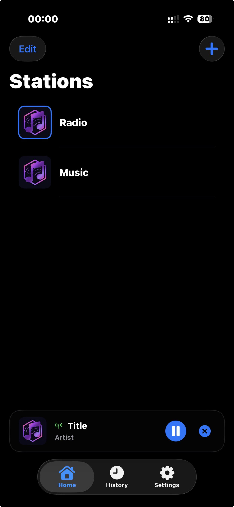
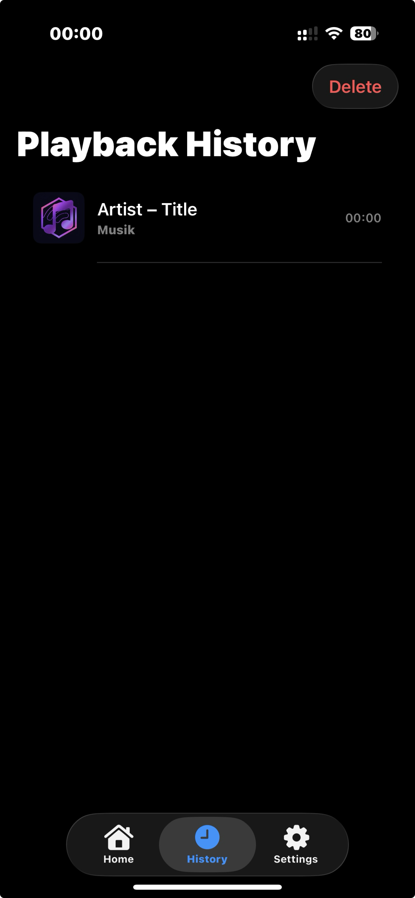

  

AzuraPlayer is an app for streaming your self-hosted AzuraCast radio stations.

**Features:**
- Add multiple AzuraCast stations
- Play live streams directly in the app
- Display the currently playing song with title and artist
- Show album artwork of the current song
- Option to set a custom station cover
- Option to enable or disable song artwork display
- Dark Mode support
- Sleep Timer
- AzuraPlayer is an unofficial app and is not affiliated with or endorsed by the AzuraCast developers.
- Export and import of stations via JSON

This is my first iOS app. I work in IT, but not as a software developer, so I used Claude (AI) as a support tool throughout the development process. I want to be transparent about that.

https://testflight.apple.com/join/nFmb5g4Q

<table>
  <tr>
    <td></td>
    <td></td>
    <td></td>
    <td></td>
  </tr>
</table>

